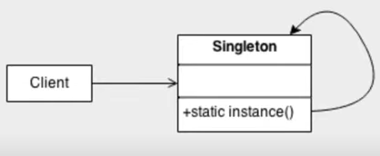

# 
 <b> Laboratório de padrões de projeto com Spring  </b>

## 💻 Sobre o projeto   

Este repositorio contem todo conteúdo que foi desenvolvido durante o *Laboratório de padrões de projeto com Spring* ministrado pelo
professor **Venilton Flavo Jr**.

## *Padrão Singleton*
Permite a criação de uma única instância de uma classe e fornece um modo para recuperá-la.

  
Fonte: www.sourcemaking.com

## 🛠 Tecnologias Utilizadas

* IDE IntelliJ
* Java 17
* Maven
* Spring Boot

