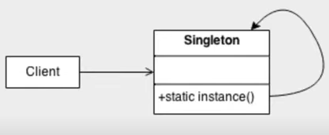
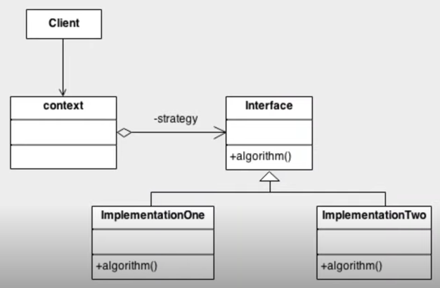
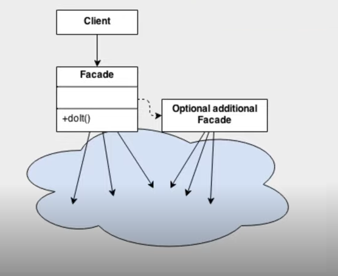

# 
 <b> Laboratório de padrões de projeto com Spring  </b>

## 💻 Sobre o projeto

Este repositorio contem todo conteúdo que foi desenvolvido durante o *Laboratório de padrões de projeto com Spring* ministrado pelo
professor **Venilton Flavo Jr**.

## *Padrão Singleton*
Permite a criação de uma única instância de uma classe e fornece um modo para recuperá-la.

  
Fonte: www.sourcemaking.com

## *Padrão Strategy*
Simplifica a variação de algoritmos para a resolução de um mesmo problema.

  
Fonte: www.sourcemaking.com

## *Padrão Facade*
Provem uma interface que reduz a complexidade nas integrações com subsistemas.
  
Fonte: www.sourcemaking.com

## *Explorando padrões de projeto com Spring*
* Singleton: @Bean e @Autowired;
* Strategy: @Service e @Repository;
* Facade: Criar uma outra API com o mesmo objetivo desse padrão para abstrair a complexidade das integrações.  

## 🛠 Tecnologias Utilizadas

* IDE IntelliJ
* Java 17
* Maven
* Spring Boot
* PostgreSQL

